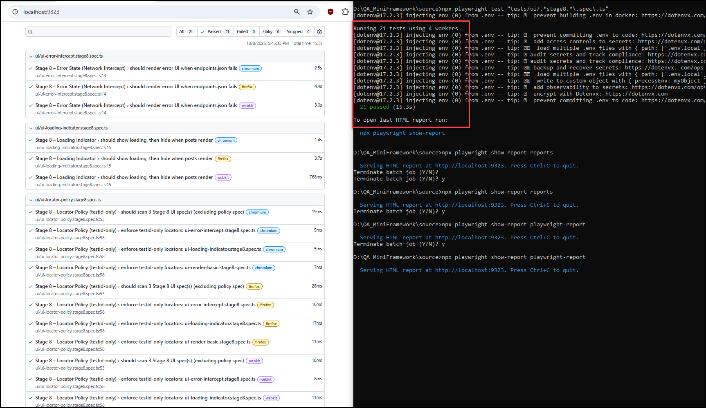

# QA Mini Framework (Playwright)

[](https://github.com/MotivusQuiroz/qa-mini-framework/actions/workflows/ci.yml)

Mini Playwright framework with API tests (GET/POST), basic reporting, and clean structure.

## Quickstart

Clone and run from a clean machine:

```bash
# 1. Clone the repo
git clone https://github.com/<your-username>/<your-repo>.git
cd <your-repo>/source

# 2. Install dependencies
npm install

# 3. Install Playwright browsers
npx playwright install --with-deps

# 4. Start mock UI server
npx http-server -p 5173 -c-1 . &
		
# 5. Run all tests
npx playwright test

# 6. Open the last HTML report
npx playwright show-report reports
```

## Prereqs

- Node.js LTS installed (`node -v`, `npm -v`)
- Git installed (`git --version`)
- OS: Windows 10/11

## Project layout

```
D:\QA_MiniFramework\source
│
├── config/                # API endpoints and config files
├── tests/
│   └── api/               # API test specs
│       ├── posts.get.spec.ts
│       ├── posts.getById.spec.ts
│       ├── posts.post.spec.ts
│       └── posts.post.negative.spec.ts
├── package.json           # Dependencies and scripts
└── README.md
```

## Install

```bash
npm ci || npm install
```

## Useful scripts

```bash
# run all tests (all projects)
npm run test:all

# run only API tests folder
npm run test:api

# run a single test file (example)
npx playwright test tests/api/posts.getById.spec.ts --project=chromium

# open the last HTML report
npm run report:open
```

## Notes

- Reports are generated locally in the `reports/` folder and are **not** committed to Git.
- API base: https://jsonplaceholder.typicode.com (public fake API).

---

## Reports & Artifacts (Stage 9)

### Generate an HTML report

From the project root:

```bash
npx playwright test
```

### Open the latest report

```bash
npx playwright show-report reports
```

### Where to find artifacts

- HTML report: `playwright-report/index.html` (or `reports/` if configured that way).
- Test artifacts (screenshots, traces, videos): stored under `test-results/`.

### Run filtered tests

Run only Stage 8 UI tests, for example:

```bash
npx playwright test "tests/ui/.*stage8.*\.spec\.ts"
```

### Notes

- Reports and artifacts are **local only**; they are not pushed to Git.
- Opening or viewing reports (npx playwright show-report reports) does **not** require the dev server; only running UI tests does.
- Keep your dev server running if you execute UI tests manually

---

## Configuration & Secrets (Stage 11)

This project uses environment variables for configuration.

- **Local development**:  
  Copy `.env.example` → `.env`, then adjust values as needed.

- **CI (GitHub Actions)**:
  1. Go to your repo → **Settings** → **Secrets and variables** → **Actions**
  2. Click **New repository secret**
  3. Enter a name (e.g., `API_KEY`) and set its value
  4. In `.github/workflows/ci.yml`, reference it like:

     ```yaml
     env:
       API_KEY: ${{ secrets.API_KEY }}
     ```

⚠️ Never commit real secrets or `.env` files into Git — only `.env.example` with safe defaults should be committed.

---

## Repo Map (Stage 12)

Project structure overview:

```
source/
├── config/                 # Configuration files (Playwright config, endpoints.json)
├── tests/                  # Test specs
│   ├── api/                # API tests (Stage 6)
│   ├── ui/                 # UI tests (Stage 8)
│   └── utils/              # Helpers (builders, assertions, env helpers)
├── .github/workflows/      # GitHub Actions workflows (CI)
├── package.json            # Dependencies and scripts
├── README.md               # Project documentation
├── reports/                # Playwright HTML reports (generated)
└── test-results/           # Raw artifacts (screenshots, traces)
```

---

## Running Tests (Stage 12)

### Run API tests only

```bash
npx playwright test "tests/api/.*\.spec\.ts"
```

### Run UI tests only

```bash
npx playwright test "tests/ui/.*\.spec\.ts"
```

### Run Stage 6 API specs only

```bash
npx playwright test "tests/api/.*stage6.*\.spec\.ts"
```

### Run all tests

```bash
npx playwright test
```

### Open the last HTML report

```bash
npx playwright show-report reports
```

---

## Troubleshooting (Stage 12)

- **Error: dotenv not found** → run `npm install dotenv --save-dev`
- **Tests fail with 201 instead of 400/422** → jsonplaceholder always returns 201 for POST; tests allow both 201 and error codes
- **No tests found** → ensure the regex is quoted in Windows CMD:
  ```bat
  npx playwright test "tests/api/.*stage6.*\.spec\.ts"
  ```
- **CI run is slow (~20 mins)** → first run downloads browsers; later runs are faster with cache

---

## Definition of Done (Stage 12)

- README contains Quickstart, Repo Map, How to run tests, Reports & Artifacts, Configuration & Secrets, and Troubleshooting
- A new contributor can clone the repo, follow the README, and run tests successfully without extra guidance

---

## Final Demo Script (Stage 13)

### One-liner bootstrap

```bash
git clone https://github.com/MotivusQuiroz/qa-mini-framework.git && cd qa-mini-framework/source && npm install && npx playwright install --with-deps && npx http-server src/mock-ui -p 5173 -c-1 . & npx playwright test && npx playwright show-report
```

### Demo Evidence



### Links

- [Repository](https://github.com/MotivusQuiroz/qa-mini-framework)
- [Latest CI Run](https://github.com/MotivusQuiroz/qa-mini-framework/actions)
- [Report Artifact] (download from Actions → latest run → Artifacts)

---

## Quality Gate & Wrap-Up (Stage 14)

### Lint & Format

```bash
npx prettier --write .
npx eslint .
```

### Optional commit hooks

Use Husky or simple `pre-commit` to enforce lint/format before commits (optional).

### Tag and Release

```bash
git tag v1.0
git push origin v1.0
```

Then create **GitHub Release Notes** summarizing features and linking the passing CI run.

---

## Definition of Done (Stage 14)

- Prettier/ESLint run clean.
- Optionally commit hooks active.
- Repo tagged `v1.0` and GitHub Release created.
- Evidence checklist complete and CI badge green.
